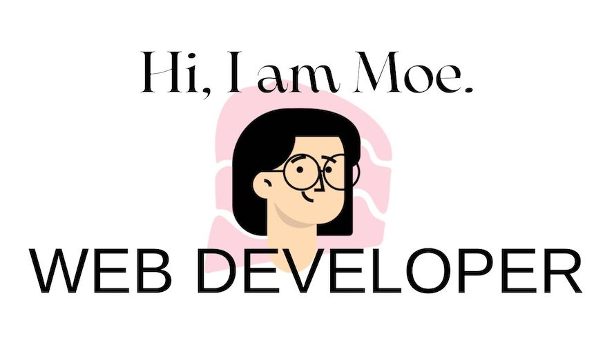

# 🗣️ About Me:
Hi, I am Moe, a passionate web developer based in Australia. 

# 🌐 Socials:
 

# 💻 Technologies:
           

# 📚 Currently studying...

<!-- Proudly created with GPRM ( https://gprm.itsvg.in ) -->

